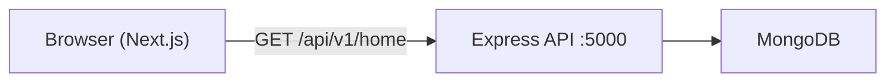

# Airbnb Clone

A full-stack vacation rental platform inspired by [Airbnb](https://www.airbnb.com). Browse curated listing carousels on the home page, search by destination, dates, and guests, and explore a responsive UI built to mirror the real product on both desktop and mobile.

This is a learning and portfolio project — not affiliated with or endorsed by Airbnb.

## Features

### Implemented

- **Home page** — Dynamic listing carousels (Popular homes, hotel deals, city-specific sections) powered by the backend API
- **Search experience** — Where / When / Who search bar with date picker, flexible dates, guest selector, and popular destinations
- **Responsive layout** — Separate desktop and mobile headers; full-screen search overlay on mobile
- **Login page UI** — Email/phone flow with social sign-in buttons (UI only)
- **Locale dialog** — Currency and language selection UI
- **REST API** — Express backend with MongoDB, security middleware, and a home endpoint that returns sectioned listing data
- **Seed data tooling** — Scripts to generate and import sample listings

### In progress / planned

- User authentication (JWT, bcrypt models are in place)
- Booking flow (schema defined, routes not yet wired)
- Listing detail pages
- Host dashboard

## Tech stack

| Layer    | Technologies |
| -------- | ------------ |
| Frontend | [Next.js 16](https://nextjs.org), [React 19](https://react.dev), [TypeScript](https://www.typescriptlang.org), [Tailwind CSS 4](https://tailwindcss.com), [shadcn/ui](https://ui.shadcn.com), [TanStack Query](https://tanstack.com/query), [Embla Carousel](https://www.embla-carousel.com), [Motion](https://motion.dev) |
| Backend  | [Express 5](https://expressjs.com), [TypeScript](https://www.typescriptlang.org), [Mongoose 9](https://mongoosejs.com) |
| Database | [MongoDB](https://www.mongodb.com) |
| Security | Helmet, CORS, rate limiting, HPP, compression |

## Architecture



The frontend talks to the backend through a shared `apiClient`. The home service queries MongoDB with carousel-specific filters and returns DTOs shaped for the UI carousels.

## Project structure

```
airbnb/
├── frontend/                 # Next.js app (App Router)
│   ├── app/
│   │   ├── _components/      # Layout, search, and UI components
│   │   ├── context/          # Search and locale state
│   │   ├── features/         # API calls, hooks, shared types
│   │   ├── lib/              # API client and utilities
│   │   └── login/            # Login page
│   └── public/               # Static assets (images, icons)
│
└── backend/
    ├── app.ts                # Express app setup
    ├── server.ts             # Server entry + DB connection
    └── src/
        ├── controllers/      # Route handlers
        ├── services/         # Business logic
        ├── models/           # Mongoose schemas (User, Listing, Booking)
        ├── routes/           # API routers
        ├── dto/              # Response mappers and types
        ├── middleware/       # Error handling
        └── dev-data/         # Seed data generation and import
```

## Prerequisites

- [Node.js](https://nodejs.org) 20+
- [MongoDB](https://www.mongodb.com/try/download/community) running locally, or a [MongoDB Atlas](https://www.mongodb.com/atlas) cluster

## Getting started

### 1. Clone the repository

```bash
git clone https://github.com/Mohammad-EisaZadeh/Airbnb.git
cd Airbnb
```

### 2. Configure the backend

Create `backend/config.env` (this file is gitignored):

```env
NODE_ENV=development
PORT=5000
DATABASE_LOCAL=mongodb://127.0.0.1:27017/airbnb
```

For MongoDB Atlas, replace `DATABASE_LOCAL` with your connection string.

### 3. Install dependencies and seed the database

```bash
cd backend
npm install
```

Import sample listings (requires MongoDB to be running):

```bash
npx tsx src/dev-data/import-dev-data.ts --import
```

To clear all listings:

```bash
npx tsx src/dev-data/import-dev-data.ts --delete
```

To regenerate seed JSON (writes 2,000 random listings):

```bash
npx tsx src/dev-data/generateListings.ts
```

Start the API server:

```bash
npm run start:dev
```

The backend runs at **http://localhost:5000**.

### 4. Configure and run the frontend

In a separate terminal:

```bash
cd frontend
npm install
```

Optional — create `frontend/.env.local` if the API is not on the default URL:

```env
NEXT_PUBLIC_API_URL=http://localhost:5000/api/v1
```

Start the dev server:

```bash
npm run dev
```

Open **http://localhost:3000** in your browser.

## Environment variables

| Variable | Location | Default | Description |
| -------- | -------- | ------- | ----------- |
| `DATABASE_LOCAL` | `backend/config.env` | — | MongoDB connection string |
| `PORT` | `backend/config.env` | `5000` | Backend server port |
| `NODE_ENV` | `backend/config.env` | `development` | Runtime environment |
| `NEXT_PUBLIC_API_URL` | `frontend/.env.local` | `http://localhost:5000/api/v1` | Backend API base URL |

## API reference

### `GET /api/v1/home`

Returns home page carousel sections with listing cards.

**Query parameters**

| Param | Type | Default | Description |
| ----- | ---- | ------- | ----------- |
| `city` | string | `Tehran` | City used for location-based carousels |

**Example**

```bash
curl "http://localhost:5000/api/v1/home?city=Tehran"
```

**Response**

```json
{
  "status": "success",
  "data": {
    "sections": [
      {
        "id": "popular_tehran",
        "sectionTitle": "Popular homes in Tehran",
        "items": [
          {
            "id": "...",
            "title": "Beautiful apartment in Tehran",
            "type": "apartment",
            "city": "Tehran",
            "coverImage": "https://picsum.photos/500/300?random=1",
            "pricePreview": { "nights": 3, "total": 450, "currency": "USD" },
            "hostType": "individual",
            "rating": { "average": 4.8, "count": 120 },
            "checkIn": "2026-06-18T...",
            "checkOut": "2026-06-21T..."
          }
        ]
      }
    ]
  }
}
```

## Scripts

### Frontend (`frontend/`)

| Command | Description |
| ------- | ----------- |
| `npm run dev` | Start Next.js dev server |
| `npm run build` | Production build |
| `npm run start` | Run production server |
| `npm run lint` | Run ESLint |

### Backend (`backend/`)

| Command | Description |
| ------- | ----------- |
| `npm run start:dev` | Start API with hot reload (`tsx watch`) |
| `npm run start:prod` | Start in production mode |

## Development notes

- CORS is configured to allow `http://localhost:3000` with credentials.
- Listing images in seed data use [picsum.photos](https://picsum.photos); the Next.js config whitelists this host for `next/image`.
- The frontend uses TanStack Query with a 5-minute stale time for home page data.
- Mongoose models exist for **User**, **Listing**, and **Booking**; only the home endpoint is exposed so far.

## License

This project is for educational purposes. No license has been specified yet.
